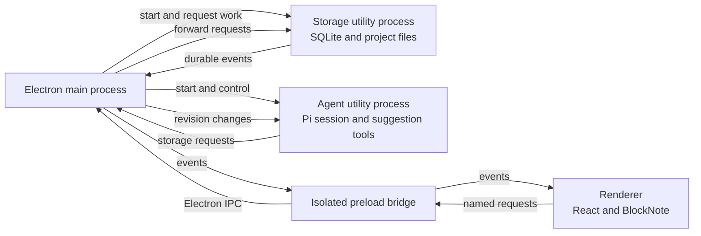

# Architecture Review

This review describes the application as it exists on 2 July 2026 and recommends a path for changing it safely. It is written for the whole team. No knowledge of Electron, React, databases, or artificial-intelligence agent systems is assumed.

The assessment was made from the implementation and its tests, independently of the existing architecture guide. Links point to supporting code, but the explanation here is intended to stand on its own. Statements labelled **Observed** describe current code or validation results. Statements labelled **Risk** are reasoned consequences that may occur as the product grows. Statements labelled **Recommendation** propose future work; they do not describe existing behavior.

## 1. Architecture Present Today

### What starts, and how the pieces communicate

Electron is a framework for shipping a web-style user interface as a desktop application. The **Electron host** is the complete desktop program. Within it, the application deliberately runs several operating-system processes rather than putting all work in one place:

- The **main process** starts the application, creates windows, opens native file dialogs, and coordinates the other processes. There is one main process for the application.
- A **renderer** is the process that draws a window with web technologies. The main workspace and the development-only suggestion window are renderers. They run the React interface but have no direct Node.js or file-system access.
- An **isolated preload bridge** is a small, restricted adapter loaded before a renderer. “Isolated” means the page cannot directly reach the bridge's Electron internals. It exposes only the named operations the interface needs.
- A **utility process** is a background process created by Electron for non-interface work. ScribeAI uses one utility process for storage and another for the Pi writing agent. A failure or heavy task there is therefore separated from the interface and main process.

The application starts in this order:

In prose, the main process first starts storage and waits until it is ready. Storage opens the database, creates or resets its tables, ensures the default project and document exist, and repairs the Markdown file used by the agent. The main process then starts the agent and waits for its initialization. It registers the renderer-facing operations and creates the workspace window. The renderer can request data only through the preload bridge. The main process forwards storage work to the storage utility process and agent controls to the agent utility process. Storage sends committed changes back as events. The main process broadcasts those events to renderer windows and tells the agent when the durable project revision changes. The agent cannot write project files; it asks the main process to forward suggestion operations to storage. The startup sequence is implemented in [`desktop/main.ts`](../desktop/main.ts), with storage startup in [`desktop/storage.ts`](../desktop/storage.ts) and agent startup in [`desktop/agent.ts`](../desktop/agent.ts).

### Responsibility and state ownership

Before naming architectural patterns, the practical ownership is:

| Part | What it is responsible for today |
| --- | --- |
| Renderer | The currently displayed editor content; selected, viewed, pinned, previewed, and positioned suggestion state; responsive layout; keyboard interaction; temporary agent-control errors. |
| Main process | Process startup and shutdown, window security, native dialogs, request routing, event broadcasting, current in-memory agent status, and recent in-memory agent activity. |
| Storage utility process | The SQLite database, document and source revisions, the `draft.md` mirror, imported source files, durable suggestion snapshots, suggestion deduplication (prevention of repeated items), and durable suggestion mutation checks. |
| Agent utility process | The Pi session, autonomous work loop, model/tool availability, and requests to list, create, update, or retract suggestions. |
| Preload bridge | The small set of renderer-to-main requests and the main-to-renderer event subscription. It owns no business state. |

The renderer uses a React **reducer**, a function that calculates the next state from the previous state and an action, for suggestion behavior. This makes selection, dismissal, pinning, workspace placement, previews, and incoming agent events a single explicit **state machine**: a set of allowed states and transitions. The reducer is pure, meaning it does not perform file, network, or process work while calculating a result. The implementation is in [`src/suggestions/inbox.ts`](../src/suggestions/inbox.ts), and the durable subset of that state is defined in [`src/suggestions/state.ts`](../src/suggestions/state.ts).

The durable subset is a **projection**: a stored view derived from richer live state. In this case it contains the live queue, pinned items, workspace cards, deduplication keys, and stacking order, but excludes temporary selection and active-preview identifiers. After hydration, every reducer change projects the state and asks storage to replace the stored suggestion snapshot.

Storage also changes suggestion state directly when the agent publishes, updates, or retracts a suggestion. It then emits a suggestion event so the renderer can make the corresponding reducer transition. This means storage and the renderer both currently write different updates to the same durable suggestion snapshot. The behavior is visible across [`desktop/storage.ts`](../desktop/storage.ts), [`src/workspace/useWorkspaceController.ts`](../src/workspace/useWorkspaceController.ts), and [`src/suggestions/inbox.ts`](../src/suggestions/inbox.ts).

### Interface composition and editing

React is the interface library. Its **composition root** is the place where the major interface parts are created and connected. [`src/main.tsx`](../src/main.tsx) obtains the desktop bridge and mounts [`src/App.tsx`](../src/App.tsx). `App` creates the BlockNote editor, workspace layout controller, workspace behavior controller, keyboard controller, navigation, editor, suggestion dock, drawers, and help interface.

Most visible components are **prop-driven**: a parent gives them data and callback functions through named inputs called props. For example, [`src/components/EditorWorkspace.tsx`](../src/components/EditorWorkspace.tsx) receives an editor, layout flags, workspace pins, and callbacks, then passes the relevant subset to the header and editor. [`src/components/SuggestionDock.tsx`](../src/components/SuggestionDock.tsx) similarly receives suggestion and agent state rather than reading desktop services itself. This keeps much of the display layer independent from persistence and process details.

BlockNote is the structured rich-text editor embedded in the renderer. It represents a document as typed blocks rather than only as one string. ScribeAI extends its **schema**, the rules describing allowed block types and data, with a temporary suggestion-preview block in [`src/editor/schema.tsx`](../src/editor/schema.tsx). [`src/components/DocumentEditor.tsx`](../src/components/DocumentEditor.tsx) renders the editor and overlays movable suggestion cards. When saving, the controller removes preview blocks, stores the remaining block data, and also asks BlockNote to produce Markdown. The Markdown conversion is described as lossy because not every detail in rich editor data necessarily has an exact Markdown equivalent.

Concrete preview example: selecting “Preview in draft” for a text suggestion inserts a temporary preview block after the writer's last active block. Accepting the preview turns it into ordinary document content; cancelling removes it. A preview is never included in autosave. Preview resolution travels through a small renderer event channel in [`src/editor/previewEvents.ts`](../src/editor/previewEvents.ts) and returns to the suggestion reducer.

### Requests, commands, events, and process boundaries

A **command** asks a part of the system to do something, such as “save this document” or “start the agent.” An **event** reports something that has already happened, such as “the document was saved.” Commands can fail and normally have one result. Events may have multiple listeners and should not be treated as requests.

**Inter-process communication (IPC)** is Electron's mechanism for messages between the renderer and main process. The preload bridge exposes commands such as `hydrate`, `saveDocument`, `saveSuggestionState`, `importSource`, `startAgent`, and `stopAgent`. It also exposes one event subscription. The TypeScript shape is shared in [`src/shared/desktop.ts`](../src/shared/desktop.ts), the actual bridge is in [`desktop/preload.ts`](../desktop/preload.ts), and sender checks and handlers are in [`desktop/main.ts`](../desktop/main.ts).

The bridge is explicit and narrow. The renderer has context isolation, sandboxing, and Node.js integration disabled. The main process also rejects requests not associated with one of its windows. These measures reduce the damage that compromised renderer code could cause.

The main, storage, and agent processes use **child-process remote procedure calls (RPCs)**. An RPC is a message that names a method and request identifier, followed later by a result with the same identifier. The `ChildRpc` helper in the main process keeps pending promises by identifier. The agent uses a similar request/result map for storage calls. This provides request correlation, but the method names and parameters are still mostly free-form strings and `unknown` values at runtime.

Concrete publishing example:

1. The agent calls its `create_suggestion` tool. The tool is a command exposed by the Scribe Pi extension.
2. The extension adds the document revision the agent reviewed. This is an optimistic revision check: storage accepts the command only if that revision is still current.
3. The agent utility process sends a storage request to the main process, which forwards it to storage.
4. Storage validates the suggestion, checks the revision, checks its deduplication key, and updates SQLite in a **transaction**. A transaction commits all its database changes together or discards them all. The same transaction adds a `suggestion.added` event to an **outbox**, a table of committed events waiting to be delivered.
5. After the transaction commits, storage posts the event to the main process. The main process broadcasts it to renderers.
6. The renderer reducer adds the suggestion and then sends its latest suggestion projection back for storage.

The tool definitions and revision attachment are in [`desktop/scribe-extension.ts`](../desktop/scribe-extension.ts); the durable checks and transaction are in [`desktop/storage.ts`](../desktop/storage.ts).

### Persistence, hydration, and autosave

SQLite is an embedded relational database stored in one local file. It holds one project, one document's BlockNote blocks and Markdown, imported-source metadata, suggestion state, and an event outbox. The database uses **write-ahead logging**, which records changes in a companion log before merging them into the main file, and waits for full disk synchronization. Both settings are intended to improve durability. The schema and all storage operations currently share [`desktop/storage.ts`](../desktop/storage.ts).

The **Markdown mirror** is `draft.md`, a plain-text copy of the current document created for the read-only agent. A save writes a temporary file and renames it over `draft.md`; this is an **atomic write**, meaning readers should see either the old complete file or the new complete file rather than a partly written file. Startup compares this mirror with SQLite and replaces it if needed. Imported Markdown sources are copied under `sources/` with collision-safe readable names.

**Hydration** means loading durable state into live memory when the interface starts. The renderer requests one workspace snapshot, replaces the editor blocks, records document identity and revision, loads sources and agent state, and dispatches the stored suggestion projection to the reducer. It suppresses document autosave while doing so. This coordination is in [`src/workspace/useWorkspaceController.ts`](../src/workspace/useWorkspaceController.ts).

**Autosave** means saving shortly after editing without an explicit Save action. Each editor change resets a 650 millisecond timer. When the timer fires, the renderer excludes preview blocks, generates Markdown, and appends the save to a promise queue: a chain that starts each save only after the previous save finishes. Each save supplies the last acknowledged document revision. Storage rejects a stale revision instead of silently overwriting a newer document, and a successful response advances the renderer's revision.

Concrete edit example: a writer changes a paragraph three times quickly. The timer is restarted for each change, so only the settled content is queued after 650 milliseconds. Storage first atomically replaces `draft.md`, then updates the block data and Markdown in SQLite, increments document and project revisions, commits a `document.saved` event, and returns the new snapshot. The main process forwards the new revisions to the agent so it can review durable content, not an unsaved editor state.

Pi is the library that runs the writing-agent session. A **Pi session** is the durable conversation and custom state associated with the project. Session files live below the project workspace, while Pi authentication and model configuration live in the application data directory. The agent continues the most recent project session and stores autonomous-loop checkpoints as custom session entries. The agent has only `read`, `grep`, `find`, and `ls` project tools plus Scribe's suggestion tools; shell, write, and edit tools are excluded. This is enforced in [`desktop/agent.ts`](../desktop/agent.ts) and tested in [`desktop/pi-session.test.ts`](../desktop/pi-session.test.ts).

### Build, validation, and test boundaries

The production build has three boundaries. TypeScript checks renderer and desktop code under separate configurations. Vite bundles the React renderer. The Electron plugin builds separate main, storage, agent, and preload outputs. External package dependencies for Electron processes are left unbundled. Configuration is in [`package.json`](../package.json), [`vite.config.ts`](../vite.config.ts), [`tsconfig.app.json`](../tsconfig.app.json), and [`tsconfig.desktop.json`](../tsconfig.desktop.json).

Vitest runs most interface and hook tests in a simulated browser called jsdom. Pure reducer and loop tests exercise state transitions without starting Electron. Node-environment tests call storage against temporary files and an in-memory database and create Pi sessions in temporary directories. Component tests cover focused user interactions. There is no test that starts the packaged Electron application, crosses the real preload boundary, or exercises main-process request routing end to end.

**Observed validation:** the planning brief recorded an earlier baseline of 69 passing tests. A fresh run for this review passed **97 tests across 21 files**. Lint passed. The production build passed. The build emitted Vite's large-chunk warning: the main renderer JavaScript file was **1,297.67 kilobytes (kB) before compression (388.43 kB compressed)**, above the 500 kB warning threshold. Generated build files were not added to this review.

### Current strengths and constraints

Observed strengths are:

- **Process isolation.** Storage and agent work do not execute in the renderer, and secure window preferences limit renderer privileges ([`desktop/main.ts`](../desktop/main.ts)).
- **Explicit bridge contracts.** Renderer capabilities are named and limited, and subscriptions can be removed ([`desktop/preload.ts`](../desktop/preload.ts), [`src/shared/desktop.ts`](../src/shared/desktop.ts)).
- **Pure state-machine tests.** Suggestion and autonomous-loop transitions are directly testable without a desktop runtime ([`src/suggestions/inbox.test.ts`](../src/suggestions/inbox.test.ts), [`desktop/scribe-loop.test.ts`](../desktop/scribe-loop.test.ts)).
- **Read-only agent tools.** The model can inspect project files but can change product state only through validated suggestion tools ([`desktop/agent.ts`](../desktop/agent.ts), [`desktop/scribe-extension.ts`](../desktop/scribe-extension.ts)).
- **Revision checks.** Document autosaves and agent suggestion mutations reject work based on an outdated document revision ([`desktop/storage.ts`](../desktop/storage.ts)).
- **Atomic Markdown writes.** Temporary-file replacement avoids exposing a partly written draft, and startup can repair the mirror ([`desktop/storage.ts`](../desktop/storage.ts)).
- **Presentation-component boundaries.** Most visible components receive data and callbacks rather than importing persistence or Electron services directly ([`src/components/EditorWorkspace.tsx`](../src/components/EditorWorkspace.tsx), [`src/components/SuggestionDock.tsx`](../src/components/SuggestionDock.tsx)).

The most important current constraints are deliberate single-workspace assumptions. Project and document identifiers are constants in storage and refs in the renderer. Paths always use `default-project`, and hydration always returns that one document. The sidebar shows static sections; “New Document” and most navigation items have no routing behavior. Source rows display imported files but do not select a document or project. These facts are visible in [`desktop/storage.ts`](../desktop/storage.ts), [`desktop/main.ts`](../desktop/main.ts), [`src/workspace/useWorkspaceController.ts`](../src/workspace/useWorkspaceController.ts), and [`src/components/Sidebar.tsx`](../src/components/Sidebar.tsx).

## 2. Shortcomings and Recommended Changes

The findings below separate present behavior from future risk. Effort uses **small**, **medium**, or **large** as relative engineering size. Implementation risk estimates the chance of regressions while making the change. Expected benefit describes the result if the change succeeds.

### Immediate, lower-risk improvements

#### Sequence suggestion saves and make failures visible

1. **What currently happens — observed.** Every persisted reducer change starts `saveSuggestionState` without awaiting or queueing prior calls. A rejection is written only to the developer console. Unlike document saves, suggestion saves have no expected revision, acknowledgement held in interface state, retry, or visible error ([`src/workspace/useWorkspaceController.ts`](../src/workspace/useWorkspaceController.ts)).
2. **Why it may become a problem — risk.** The application does not define that the newest snapshot must win. Delayed or failed calls can leave SQLite older than the interface, and a restart can appear to undo a dismissal, pin, or card movement. Rapid geometry changes make the exposure more likely.
3. **Who or what it affects.** Writers, suggestion-state correctness, support diagnostics, and any future synchronization feature.
4. **Recommended change.** Serialize projection saves as document saves already are. Coalesce pending snapshots where safe, retain the last acknowledged version, surface failure near the suggestion workspace, and offer retry or resynchronization. Do not claim success until storage acknowledges it.
5. **Assessment.** Effort: small. Implementation risk: low. Expected benefit: high and immediate data-loss protection.

#### Extract workspace coordination into focused application services

1. **What currently happens — observed.** `App` is the composition point, while one `useWorkspaceController` hook coordinates hydration, document autosave, source import, agent control, activity, preview insertion, and suggestion persistence ([`src/App.tsx`](../src/App.tsx), [`src/workspace/useWorkspaceController.ts`](../src/workspace/useWorkspaceController.ts)).
2. **Why it may become a problem — risk.** These flows have different timing, failure, and cleanup rules. Sharing one hook increases dependency coupling and makes changes to one lifecycle more likely to affect another. It also encourages one combined error model.
3. **Who or what it affects.** Engineers changing startup, saves, agent controls, previews, or testing; indirectly, writers when lifecycle edge cases regress.
4. **Recommended change.** Keep `App` as the composition root, but give hydration, document saving, agent control/activity, and preview coordination separate hooks or application services with explicit inputs, outputs, status, and cleanup. “Application service” here means code that coordinates a user-facing operation without drawing interface elements or performing storage itself.
5. **Assessment.** Effort: medium. Implementation risk: low to medium because hook timing is sensitive. Expected benefit: medium now and high as more documents are introduced.

#### Split oversized modules along existing responsibilities

1. **What currently happens — observed.** Suggestion reduction, projection, subscription, and hook actions share one large module. Workspace pin rendering also contains geometry rules, pointer and keyboard interaction, bounds observation, and card presentation. The workspace controller combines several unrelated lifecycles ([`src/suggestions/inbox.ts`](../src/suggestions/inbox.ts), [`src/components/WorkspacePins.tsx`](../src/components/WorkspacePins.tsx), [`src/workspace/useWorkspaceController.ts`](../src/workspace/useWorkspaceController.ts)).
2. **Why it may become a problem — risk.** Large modules obscure which rules are pure and which touch React or browser integration points. Reviews and tests become broader than the change being made.
3. **Who or what it affects.** Maintainers, reviewers, and test authors.
4. **Recommended change.** Split only at boundaries already present: pure suggestion transitions versus React subscription, geometry calculations versus interaction hook versus card view, and the focused coordination services described above. Preserve public behavior and avoid a folder-per-function structure.
5. **Assessment.** Effort: medium. Implementation risk: low if performed in small moves with existing tests. Expected benefit: medium maintainability and review clarity.

#### Centralize suggestion capabilities and validation rules

1. **What currently happens — observed.** Suggestion families and some type guards are central, but capability decisions are spread across preview controls, keybindings, workspace sizing, presentation, the development form, runtime validation, and Pi tool conversion. The Pi TypeBox schema accepts broad optional fields and then performs additional family-specific checks ([`src/suggestions/types.ts`](../src/suggestions/types.ts), [`src/suggestions/validation.ts`](../src/suggestions/validation.ts), [`desktop/scribe-extension.ts`](../desktop/scribe-extension.ts)).
2. **Why it may become a problem — risk.** Adding a suggestion kind can update one surface but miss another. Producer validation and consumer assumptions can drift, particularly for nested structure nodes and preview support.
3. **Who or what it affects.** Agent tool authors, interface developers, test authors, and writers receiving malformed or inconsistently supported suggestions.
4. **Recommended change.** Define one shared capability model for each suggestion kind: whether it supports text preview, visual rendering, workspace placement, required fields, size policy, and runtime validation. Runtime validation checks real data while the application is running, after TypeScript's compile-time checks are no longer present. Use a runtime schema that reads the `kind` field and then validates exactly the fields allowed for that kind.
5. **Assessment.** Effort: medium. Implementation risk: low. Expected benefit: medium now and high for extension safety.

#### Add application-level and process-contract tests

1. **What currently happens — observed.** Reducers, hooks, components, storage functions, Pi session setup, and agent-loop rules have useful tests. The full `App`, preload channel mapping, main-process routing, child RPC lifecycle, startup ordering, and event resubscription do not have direct contract tests.
2. **Why it may become a problem — risk.** Both ends of a process boundary can compile while disagreeing at runtime. Startup failure, malformed messages, or a renamed channel may not be caught until a desktop launch.
3. **Who or what it affects.** Release confidence, desktop maintainers, and users on startup or save paths.
4. **Recommended change.** Mount the application against a deterministic fake bridge for key workflows. Add contract tests that assert the same channel names, request shapes, results, and events at preload, main, storage, and agent boundaries. Include rejected and malformed messages, process exit, and unsubscribe behavior.
5. **Assessment.** Effort: medium. Implementation risk: low. Expected benefit: high release confidence.

#### Track and reduce the renderer bundle

1. **What currently happens — observed.** The current production build succeeds but emits a large-chunk warning. The primary renderer file is 1,297.67 kB before compression. Mermaid creates many additional lazy chunks, and BlockNote and other editor dependencies contribute to the entry path.
2. **Why it may become a problem — risk.** A large startup bundle increases parse time and memory use, especially on slower hardware. Growth can continue unnoticed because there is no recorded limit.
3. **Who or what it affects.** Application startup, development rebuilds, packaged size, and lower-powered devices.
4. **Recommended change.** Record compressed and uncompressed renderer sizes in continuous integration, set a budget that fails only on meaningful regression, inspect the bundle, and lazy-load heavy features not needed for first paint. Measure startup before choosing splits; do not hide the warning by only raising its threshold.
5. **Assessment.** Effort: small for tracking, medium for reduction. Implementation risk: low to medium. Expected benefit: measurable performance control.

### Medium architectural corrections

#### Make storage the single authoritative writer for suggestion state

1. **What currently happens — observed.** Agent commands modify SQLite first and emit events. Renderer actions modify the reducer first and later replace the whole SQLite projection. Both paths can write the same `suggestion_state` row ([`desktop/storage.ts`](../desktop/storage.ts), [`src/suggestions/inbox.ts`](../src/suggestions/inbox.ts)).
2. **Why it may become a problem — risk.** A renderer snapshot based on older state can overwrite an agent update, or an agent event can be applied twice through snapshot and event paths. Multiple windows would amplify the conflict because broadcasts go to every window.
3. **Who or what it affects.** Suggestion integrity, future multi-window behavior, agent consistency, and recovery after interruption.
4. **Recommended change.** Route renderer actions such as dismiss, pin, unpin, place, move, and preview resolution to storage as commands. Storage should validate and commit each transition and then emit the resulting authoritative event or snapshot. The renderer may update optimistically for responsiveness, but must reconcile with the storage result.
5. **Assessment.** Effort: large within the medium-term program. Implementation risk: medium to high because ownership changes. Expected benefit: very high correctness and a foundation for multiple documents or windows.

#### Replace free-form process messages with validated contracts

1. **What currently happens — observed.** Renderer-facing types are documented in TypeScript, but IPC results are not runtime-validated. Child RPC methods are strings, parameters and results frequently use `unknown`, and handlers cast incoming data before partial checks. Message unions exist locally and differ by process ([`desktop/main.ts`](../desktop/main.ts), [`desktop/agent.ts`](../desktop/agent.ts), [`desktop/storage.ts`](../desktop/storage.ts)).
2. **Why it may become a problem — risk.** TypeScript types disappear in the running application. Version skew, malformed data, or a programming error can cross a trust boundary and fail far from its source.
3. **Who or what it affects.** Security posture, error diagnosis, protocol evolution, and every process boundary.
4. **Recommended change.** Create shared command, result, and event schemas keyed by literal operation names. Validate every incoming message and every persisted JavaScript Object Notation (JSON) value at runtime. JSON is the structured text format currently used for stored and transmitted objects. Generate or infer TypeScript types from the same schemas so compile-time and runtime contracts cannot drift.
5. **Assessment.** Effort: medium to large. Implementation risk: medium because latent invalid data may be exposed. Expected benefit: high reliability and safer compatibility work.

#### Define ordering, replay, acknowledgement, and resynchronization

1. **What currently happens — observed.** Storage's event outbox has an increasing sequence internally, but the sequence is not included in renderer events. An item is marked dispatched immediately after it is posted to the parent process; no consumer acknowledges it. Hydration returns a snapshot, while live events arrive through a separate subscription with no documented handoff point. Runtime and activity events exist only in main-process memory.
2. **Why it may become a problem — risk.** A renderer starting, reloading, sleeping, or briefly disconnecting can miss an event or receive events around hydration in an ambiguous order. Consumers cannot detect a gap or request only what they missed.
3. **Who or what it affects.** Renderer correctness, process restarts, future multiple windows, activity history, and supportability.
4. **Recommended change.** Give durable events a stream identity and sequence. Define whether delivery is **at-most-once**, where an event may be lost but is never repeated, or **at-least-once**, where a consumer may see a repeat and must remove duplicates. Define where acknowledgement occurs, how a snapshot states its covered sequence, and how a consumer requests **replay**, meaning redelivery of missed events, or a fresh snapshot after a gap. Treat short-lived activity separately and state that loss is acceptable if that is the product decision. **Resynchronization** should mean returning a consumer to known current state through replay or a fresh snapshot.
5. **Assessment.** Effort: large. Implementation risk: medium. Expected benefit: high resilience and unambiguous behavior.

#### Replace destructive schema resets with incremental migrations

1. **What currently happens — observed.** If SQLite's `user_version` differs from version 2, storage drops every application table and recreates the schema. This applies to older and newer versions alike ([`desktop/storage.ts`](../desktop/storage.ts)).
2. **Why it may become a problem — risk.** A normal application upgrade can erase drafts, sources metadata, suggestions, and future settings. Opening a newer database with an older build can also destroy it.
3. **Who or what it affects.** Every writer's local data and the team's ability to evolve storage safely.
4. **Recommended change.** Apply ordered, transactional, forward-only migrations from each supported version. Back up before risky migrations, refuse to open an unsupported newer schema, test upgrades from every released version, and define recovery behavior for failed migrations.
5. **Assessment.** Effort: medium now. Implementation risk: medium because it touches startup. Expected benefit: critical data safety; complete before any released schema change.

#### Separate storage responsibilities

1. **What currently happens — observed.** One module declares schema, bootstraps data, reads and writes rows, copies files, repairs Markdown, imports sources, implements domain rules, manages the outbox, dispatches string-named methods, and starts the utility-process listener ([`desktop/storage.ts`](../desktop/storage.ts)).
2. **Why it may become a problem — risk.** Database changes, file failure, suggestion policy, and transport concerns are difficult to test or change independently. Cross-store consistency is implicit: `draft.md` is replaced before the database transaction, while startup later treats SQLite as authoritative.
3. **Who or what it affects.** Data safety, migration work, test isolation, and engineers adding projects or documents.
4. **Recommended change.** Separate schema and migrations; repositories that read and write database records; file mirroring and source import; domain operations such as revision-checked saves; and process message handling. A **repository** here is an interface that loads and stores domain records without exposing Structured Query Language (SQL), the language used to operate the database, to its callers. Keep the transaction boundary in the domain operation that needs it, not in the transport layer.
5. **Assessment.** Effort: large. Implementation risk: medium. Expected benefit: high maintainability and clearer failure recovery.

### Larger strategic changes

#### Introduce real project and document identities and scoped lifecycles

1. **What currently happens — observed.** One hard-coded project and one hard-coded document are bootstrapped and queried. The renderer keeps one document identifier in a ref. Navigation is static and has no route or selection model.
2. **Why it may become a problem — risk.** Adding a second document is not a local interface change. Autosave timers, event subscriptions, agent revisions, suggestion projections, source context, paths, and hydration all currently assume one lifetime and one identity.
3. **Who or what it affects.** Product expansion, data isolation between documents, navigation, and agent relevance.
4. **Recommended change.** Introduce project and document repositories, explicit selected identities, route or navigation state, and document-scoped lifecycle objects. Switching documents must cancel or flush the old autosave, unsubscribe from its events, clear previews, hydrate the new state, and bind agent work to the intended project and document. Decide whether suggestions and sources belong to a project, a document, or both before schema work.
5. **Assessment.** Effort: large. Implementation risk: high. Expected benefit: enables the core multi-document product direction.

#### Organize desktop code by domain, application, and infrastructure

1. **What currently happens — observed.** Desktop modules are mostly grouped by running process. Business rules, workflow coordination, SQLite, file operations, Pi integration, and message transport sit close together.
2. **Why it may become a problem — risk.** Product rules become tied to Electron and SQLite details. Testing a workflow can require importing an infrastructure-heavy module, and changing transport can affect domain behavior.
3. **Who or what it affects.** Long-term maintainability, test speed, and the ability to reuse rules in migrations or other interfaces.
4. **Recommended change.** Within each relevant product area, distinguish the **domain** (business facts and rules such as revisions and valid suggestion transitions), the **application layer** (coordination of operations such as save-document or publish-suggestion), and **infrastructure** (Electron messages, SQLite, files, and Pi integration). These are responsibility boundaries, not a requirement for a framework or three mirrored folder trees. Dependencies should point from infrastructure toward stable application/domain contracts.
5. **Assessment.** Effort: large and incremental. Implementation risk: medium if moved alongside features rather than rewritten at once. Expected benefit: high over the product's lifetime.

#### Move from mixed snapshots and events to command-driven persistence and durable projections

1. **What currently happens — observed.** The renderer sends full suggestion snapshots for interface actions, while the agent sends commands that storage converts into events. The stored suggestion row combines source facts, user choices, derived queue state, and layout geometry.
2. **Why it may become a problem — risk.** Full replacement hides intent and makes conflict resolution coarse. It is hard to audit why state changed, rebuild a damaged view, or merge two actors' changes.
3. **Who or what it affects.** Data recovery, multi-window behavior, future synchronization, analytics, and debugging.
4. **Recommended change.** Persist explicit commands or resulting domain events under one authoritative storage operation, then build durable projections for the inbox, pins, and workspace layout. “Durable projection” means a stored, rebuildable view derived from committed facts. Define retention and compaction so this does not imply keeping an unlimited event history. This change should build on, not precede, single-writer storage and event sequencing.
5. **Assessment.** Effort: large. Implementation risk: high. Expected benefit: very high only when collaboration, recovery, or complex history justifies it.

#### Add process timeouts, restart, resynchronization, and end-to-end Electron tests

1. **What currently happens — observed.** RPC calls wait without a deadline. Process exit rejects currently pending calls, but the main process does not restart storage or agent utilities. A startup failure quits the app. There is no packaged Electron test.
2. **Why it may become a problem — risk.** A hung process can leave controls pending indefinitely. A crashed agent or storage process requires a full application restart, and untested restart paths can duplicate or miss state.
3. **Who or what it affects.** Availability, unsaved work, agent controls, and release confidence.
4. **Recommended change.** Add operation-specific timeouts and cancellation, process health state, bounded restart policies, and snapshot/sequence-based resynchronization after restart. Storage failure should put the interface into a clear read-only or retry state rather than pretending saves work. Add a small end-to-end suite that launches Electron and covers startup, hydrate, edit/save/relaunch, source import through a controlled fixture, agent-unavailable behavior, and utility-process failure.
5. **Assessment.** Effort: large. Implementation risk: medium to high. Expected benefit: high operational resilience.

#### Define compatibility policies

1. **What currently happens — observed.** Documents record a schema version, SQLite records a database version, and Pi sessions store custom loop entries. There is no implemented upgrade policy for BlockNote block data, persisted suggestion JSON, Pi loop entries, or cross-process messages. Some stored JSON is cast directly to current TypeScript types.
2. **Why it may become a problem — risk.** An application update can load old shapes incorrectly, while rollback can expose newer data to older code. A partial process or packaged-file mismatch can fail unpredictably.
3. **Who or what it affects.** Upgrades, rollbacks, long-lived projects, support, and every durable or cross-process format.
4. **Recommended change.** Version each durable format and process protocol independently where their evolution differs. State the supported upgrade and downgrade range, migrate or reject deliberately, preserve unknown data where appropriate, and test representative old fixtures. Tie protocol negotiation to the validated contracts rather than relying only on application version.
5. **Assessment.** Effort: medium to define, large to implement across formats. Implementation risk: medium. Expected benefit: critical for safe long-term releases.

### Phased roadmap

The sequence should prioritize correctness and data safety before expanding the product surface:

1. **Phase 1 — protect current data and expose failure.** Queue and acknowledge suggestion saves, show save failures, add bundle tracking, and add full-application fake-bridge plus process-contract tests. Replace destructive database resets before the next schema change. These steps reduce present risk without changing product scope.
2. **Phase 2 — establish one authority and clear boundaries.** Move renderer suggestion actions to storage commands, introduce runtime-validated process contracts, define event sequence and snapshot handoff behavior, and separate storage message handling from domain operations, repositories, migrations, and files. Extract focused application services and split large modules as part of these changes rather than as an independent rewrite.
3. **Phase 3 — add multiple projects and documents.** Introduce real identities, schema relations, repositories, navigation, and document-scoped hydration, autosave, preview, suggestion, and agent lifecycles. Start only after Phase 2 prevents one document's state from overwriting another's.
4. **Phase 4 — resilience and scale.** Add timeouts, health reporting, utility-process restart and resynchronization, end-to-end Electron coverage, format/protocol compatibility tests, and measured renderer code splitting. Adopt durable event-derived projections only where recovery, history, or multi-actor requirements justify their complexity.

This order avoids building multi-document behavior on ambiguous ownership. It first makes current writes reliable, then creates a single source of truth, then expands identity and navigation, and finally hardens the system for longer lifetimes and larger workloads.
