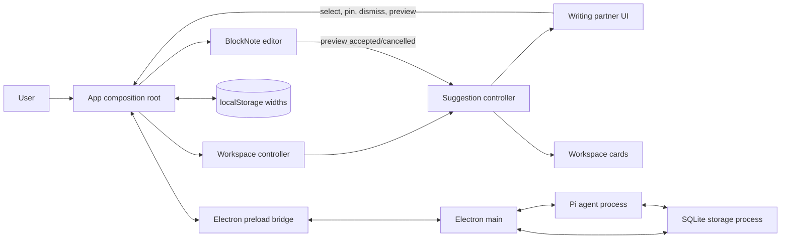
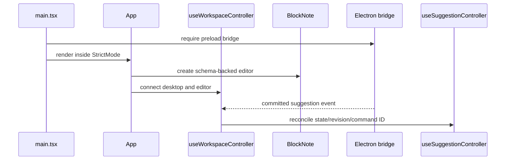
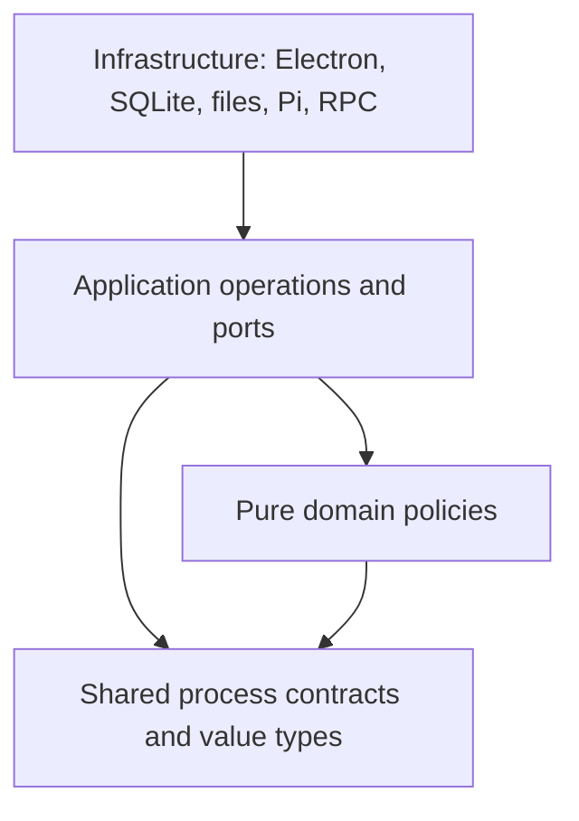

# Architecture

## Project and document scope

Projects and documents use immutable application-generated UUIDs. Mutable names and titles are display labels only. Every persistence and agent operation carries `{ projectId, documentId }`; repositories verify that the document belongs to the project before reading or writing.

Document files live at `projects/<project-id>/documents/<document-id>/`, including `draft.md`, `sources/`, and `.pi/sessions/`. SQLite schema version 1 scopes sources, suggestion projections, command receipts, immutable suggestion history, checkpoints, event streams, and consumer cursors to the document. The selected identities are persisted in the singleton workspace settings row and validated on startup. During alpha, incompatible database versions are intentionally not migrated; delete the local database to recreate the current schema.

The renderer treats a selected document as a keyed session. A switch flushes document and suggestion queues, stops the old agent, removes preview state, selects and hydrates the target, and only then enables the target state. Async controllers compare their captured session identity before applying completions. The main process replaces the document-specific Pi process on selection so its working directory and session history cannot cross document boundaries.

## System boundary

The React renderer has one application composition: Electron supplies a required preload bridge, main-process orchestration, a SQLite utility process, and a Pi utility process. Vite serves that renderer inside Electron during development and builds it for `file://` loading in production. There is still no routing library.



Desktop queries, commands, and committed events use the typed `DesktopBridge` contract. The suggestion controller derives optimistic projections through the same pure transition policy used by storage, then reconciles authoritative revisions and command IDs from storage events.

## Composition root

[`App.tsx`](../src/renderer/app/App.tsx) is the layout composition root:

1. `useCreateBlockNote` creates the editor from `writingSchema` and seeded content.
2. `useWorkspaceController` owns hydration, serialized autosave, desktop subscriptions, agent controls, inbox integration, and preview coordination.
3. `useWorkspaceLayout` and `useWorkspaceKeybindings` connect controller actions to the responsive layout.
4. `App` composes the editor, sidebars, dock, drawers, and keyboard surfaces.

The workspace controller owns one desktop event subscription. It routes suggestion events into the suggestion controller and applies other desktop events to their feature controllers.

## State ownership

| State | Owner | Lifetime / persistence |
| --- | --- | --- |
| Editor blocks and selection | BlockNote editor created in `App` | Selection is in-memory; accepted blocks autosave in Electron |
| Inbox, pins, command queue | `useSuggestionController` | Projection persists in Electron; optimistic state lives for the renderer session |
| Selected detail, preview identity, stale/withdrawn flags | `useSuggestionController` | Renderer-only and reset on hydration/document switch |
| Workspace pin geometry and z-order | Suggestion transition policy | Persists in Electron |
| Hydration, autosave queue, sources, last text cursor | `useWorkspaceController` | Current page; durable values cross the desktop bridge |
| Workspace panels, drawers, and column widths | `useWorkspaceLayout` | Panel state is in-memory; widths use `localStorage` |
| Keyboard sequence and suggestion target | Keybinding and suggestion navigation hooks | Current page only |
| Documents, Markdown mirror, sources, suggestions | SQLite/storage process | Electron application data and managed project workspace |
| Agent model/auth configuration | Pi coding-agent | Native `settings.json`, `auth.json`, and `models.json` under `<userData>/pi`; environment credentials also resolve |
| Agent session/loop state | Pi `SessionManager` and Scribe extension | Project-scoped `.pi/sessions` JSONL |
| Agent start/stop state | Agent utility process | Current launch only; every app launch starts stopped |
| Canonical agent status and error | `AgentRuntime`, reported by the agent through Electron main | Current launch only |
| Activity diagnostics | Electron main | Current-launch 500-item memory ring |
| Draft title, tab, source, and navigation data | Component constants | Static |

There is intentionally one owner for each lifecycle. Components such as `SuggestionDock`, `WorkspacePins`, and `DocumentHeader` receive values and callbacks; they do not own duplicate application state.

## Module boundaries

### `src/renderer/features/editor`

- [`schema.tsx`](../src/renderer/features/editor/schema.tsx) extends BlockNote with the `suggestionPreview` block and implements accept/cancel behavior.
- [`previewEvents.ts`](../src/renderer/features/editor/previewEvents.ts) is a small in-process event bridge from the custom block renderer back to `App`.

The editor layer knows suggestion IDs, but it does not import or mutate inbox state.

### `src/renderer/features/keybindings` and `src/renderer/features/workspace`

- `commands.ts` defines stable semantic command IDs independently of keys and handlers.
- `defaultKeymap.ts` contains the fixed `Ctrl+;` keymap; `sequenceMatcher.ts` resolves partial and complete sequences without React or DOM dependencies.
- `useKeybindingController.ts` owns global keyboard capture and timing. `useWorkspaceKeybindings.ts` is the only adapter allowed to coordinate editor, layout, and suggestion actions.
- `useWorkspaceLayout.ts` owns responsive panels, drawers, widths, and their shared imperative operations.
- `useWorkspaceController.ts` owns renderer orchestration: hydration, autosave serialization, desktop events, agent controls, inbox persistence, and preview coordination.

The command strip and shortcut dialog read the same command catalog and default keymap used for execution. This prevents discoverability copy from drifting away from the active bindings and leaves a clean keymap-replacement seam for future configurability.

### Suggestion domain and renderer feature

- [`schema.ts`](../src/domain/suggestions/schema.ts) defines suggestion data and agent event variants.
- [`state.ts`](../src/domain/suggestions/state.ts) defines the persisted projection, empty state, 30-entry limit, and shared eviction policy used by renderer and storage.
- [`aggregate.ts`](../src/domain/suggestions/aggregate.ts) is the pure suggestion aggregate and strict projection reducer. Storage records versioned intent, appends immutable facts, advances the projection, and stores the receipt in one transaction. Rebuild and repair use the same reducer; no application service writes the projection directly.
- [`transitions.ts`](../src/domain/suggestions/transitions.ts) implements the durable command and agent-event policy shared by renderer and storage.
- [`useSuggestionController.ts`](../src/renderer/features/suggestions/useSuggestionController.ts) owns optimistic commands, authoritative reconciliation, and transient selection/preview presentation.
- [`inbox.ts`](../src/renderer/features/suggestions/inbox.ts) exposes renderer-facing suggestion types and selectors.
- [`workspacePinLayout.ts`](../src/renderer/features/suggestions/workspacePinLayout.ts) supplies type-specific initial card sizes.

The durable transition policy is pure and React-independent so storage and optimistic rendering cannot drift. Stale and withdrawn flags are presentation-only because they protect transient detail/preview state rather than durable projection state.

### Runtime roots

- `src/main/index.ts` owns Electron lifecycle, renderer IPC, utility processes, revision forwarding, and the activity ring.
- `src/utility/storage/index.ts` is the storage utility-process entry point; storage behavior lives under `application/`, `persistence/`, and `workspace/`.
- `src/utility/agent/index.ts` creates the durable Pi coding-agent session and drives user-enabled autonomous cycles. Revisions continue to coalesce while the agent is stopped.
- `src/utility/agent/extension.ts` defines suggestion/yield tools and persists extension loop state.
- `src/preload/index.ts` exposes the typed desktop API.
- [`desktopClient.ts`](../src/renderer/platform/electron/desktopClient.ts) provides renderer-side access to the preload bridge.
- `src/contracts/desktop-bridge.ts` is the cross-process contract.

### Renderer features and UI primitives

- [`EditorWorkspace.tsx`](../src/renderer/features/editor/EditorWorkspace.tsx) joins the document header and editor surface.
- [`DocumentEditor.tsx`](../src/renderer/features/editor/DocumentEditor.tsx) renders BlockNote and calculates initial workspace-card placement.
- [`SuggestionDock.tsx`](../src/renderer/features/suggestions/dock/SuggestionDock.tsx) composes focused activity, detail, and queue views.
- [`WorkspacePins.tsx`](../src/renderer/features/suggestions/workspace-pins/WorkspacePins.tsx) renders desktop cards and handles bounded pointer/keyboard geometry.
- [`DocumentHeader.tsx`](../src/renderer/features/workspace/DocumentHeader.tsx) exposes responsive panel controls and document action placeholders.
- [`ResponsiveDrawer.tsx`](../src/renderer/ui/ResponsiveDrawer.tsx) provides reusable below-desktop modal panel behavior.
- [`ColumnResizeHandle.tsx`](../src/renderer/ui/ColumnResizeHandle.tsx) provides reusable pointer and keyboard column resizing.
- [`SuggestionPresentation.tsx`](../src/renderer/features/suggestions/dock/SuggestionPresentation.tsx) renders kind badges and structured suggestion visuals.
- [`MermaidDiagram.tsx`](../src/renderer/features/suggestions/dock/MermaidDiagram.tsx) lazy-loads Mermaid and renders an accessible fallback on failure.
- [`Sidebar.tsx`](../src/renderer/features/workspace/Sidebar.tsx) renders the static project navigation shell plus the persisted Electron source list and upload callback.

Components rely on their props for application actions. When adding behavior, prefer moving data and transitions into the relevant owner rather than making a display component stateful.

## Renderer bootstrap sequence

The renderer refuses to construct `App` without the Electron bridge. The complete process startup is documented separately in [Desktop persistence and Pi runtime](desktop-runtime.md#startup-and-renderer-loading).



## Data direction and dependency rules

Runtime code follows an inward dependency rule across Electron main, preload, renderer, storage, and agent:



The boundaries are concrete rather than mirrored framework folders:

- Put cross-process schemas, operation registries, and bridge-facing types in `src/contracts/`.
- Put runtime-neutral product policy shared by more than one runtime in `src/domain/` and test it without Electron, React, SQLite, files, or Pi.
- Put renderer-owned UI, hooks, and browser-only adapters under `src/renderer/`, grouped by feature first and `ui/` only for reusable primitives.
- Put window, dialog, process supervision, IPC routing, and diagnostics in `src/main/`.
- Put preload bridge exposure in `src/preload/` and keep it limited to Electron renderer APIs plus contracts.
- Put storage use cases and ports in `src/utility/storage/application/`; SQLite repositories, migrations, durable JSON mapping, outbox dispatch, and backups in `src/utility/storage/persistence/`; workspace file and identity handling in `src/utility/storage/workspace/`.
- Put agent loop policy in `src/utility/agent/domain/`, Pi SDK conversion and sessions in `src/utility/agent/pi/`, and Scribe tool integration at the agent utility-process boundary.

`scripts/source-boundaries.test.mjs` enforces that runtime-neutral modules stay free of runtime implementations, renderer code does not import privileged processes, preload stays narrow, and storage/agent utility layers do not reach across foreign runtimes. Runtime entry points are composition roots: they construct each required adapter and contain no product policy.

The intended dependency direction is:

```text
contracts + shared domain
          ↑
runtime application logic
          ↑
runtime entries and platform adapters
```

Practical rules:

- Cross-process types and schemas belong in `src/contracts/`, not in UI components or runtime entries.
- Durable suggestion lifecycle changes belong in `src/domain/suggestions/transitions.ts` and should have transition tests.
- Runtime-neutral revision, cursor, activity-redaction, or aggregate rules belong in `src/domain/` when more than one runtime uses them.
- Transport, model SDK, and Pi session code belongs in the agent utility process behind storage operations.
- Cross-feature renderer orchestration belongs in `useWorkspaceController`; `App.tsx` remains responsible for layout composition.
- CSS layout variables are set by `App` but interpreted by `src/renderer/index.css`.

## Naming and placement rules

- Use kebab-case directory names for new folders.
- Keep React component filenames in PascalCase.
- Keep hooks in `useSomething.ts` or `useSomething.tsx` beside their owning feature.
- Give each module one primary owner: contracts, domain, renderer feature, main, preload, agent utility, or storage utility.
- Put a module in `src/contracts/` only when its schema or type crosses a runtime boundary.
- Put a module in `src/domain/` only when it is runtime-neutral product policy used by more than one runtime.
- Put renderer code under the feature that owns the behavior; use `src/renderer/ui/` only for visual or interaction primitives that are not owned by one product feature.
- Keep executable entry modules thin and make their runtime obvious from their path.
- Prefer direct imports from the owning module over broad re-export trees.

## Styling architecture

Tailwind CSS 4 is loaded through the Vite plugin and `@import "tailwindcss"` in [`index.css`](../src/renderer/index.css). Most component styling is inline utility classes. The global stylesheet is reserved for:

- theme tokens and brand colors;
- base focus and typography rules;
- the responsive three-column grid;
- BlockNote variable and content overrides;
- the custom suggestion-preview block;
- Mermaid SVG sizing.

BlockNote's shadcn stylesheet is imported by `DocumentEditor.tsx`. Its utility classes are made visible to Tailwind's scanner with `@source "../node_modules/@blocknote/shadcn"`.

## Build and runtime assumptions

- TypeScript is strict and emits no files during type-checking.
- Vite targets a browser application; there is no server-side rendering guard around browser globals.
- Vite's `base` is `./` because the production renderer is loaded from `file://`; changing it back to `/` breaks all built renderer assets in Electron.
- Electron main, storage, and agent bundles are ES modules. Main must finish evaluating before Electron can become ready, so application startup is registered as a promise continuation rather than awaited at module scope.
- Mermaid is a dynamic chunk because `MermaidDiagram` imports it lazily.
- Google Fonts are external runtime requests. Font failure degrades to local fallbacks.
- `dist/`, `dist-electron/`, `release/`, `test-results/`, and `docs/html/` are generated outputs; application source code lives under `src/`.
- Files in `artifacts/` are not imported and have no runtime effect.

## Architectural invariants

Changes should preserve these unless the design is deliberately revised and documented:

1. Only one editable suggestion preview can exist at a time.
2. Preview content is user-owned once inserted; feed updates never overwrite it.
3. Pinned suggestions are frozen snapshots and ignore later feed updates or retractions.
4. The live inbox holds at most 30 entries; pinned and workspace entries do not count toward that limit.
5. Selected and previewed entries are protected from queue eviction.
6. Desktop panel state and mobile drawer state are separate.
7. Workspace geometry is clamped to the current editor canvas.
