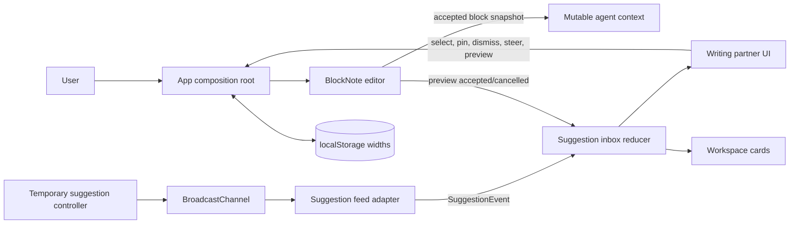
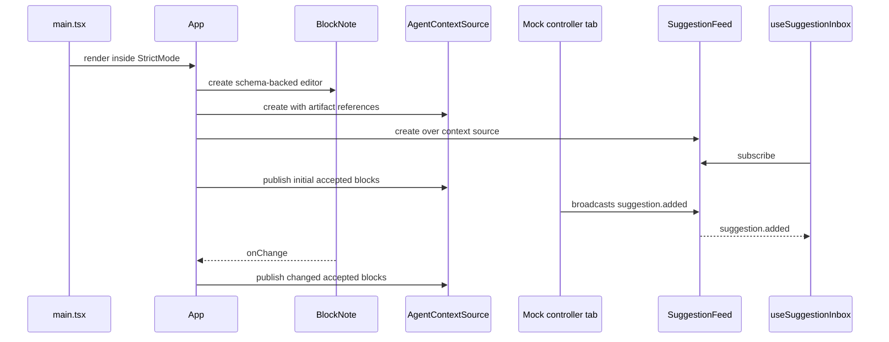

# Architecture

## System boundary

The application is browser-only React. The entry point has one temporary pathname switch for `/mock-suggestions`; there is no routing library or server boundary in the current repository.



The service-shaped interfaces exist, but their current implementations are in-memory. This separation is the main seam for adding a real agent or persistence later.

## Composition root

[`App.tsx`](../src/App.tsx) creates and connects long-lived objects:

1. `useCreateBlockNote` creates the editor from `writingSchema` and seeded content.
2. `createAgentContextSource` creates the mutable document/artifact context and is memoized for the component lifetime.
3. `createMockSuggestionFeed` creates the feed with the existing context-shaped constructor seam and is also memoized.
4. `useSuggestionInbox` subscribes to the feed and owns the suggestion lifecycle reducer.
5. `App` bridges editor changes into agent context, creates editor preview blocks, translates preview resolution events back into inbox actions, and controls responsive panels.

Keeping feed and context creation stable is important. Recreating either during a render would reset context revisions, reopen the manual channel, and resubscribe the inbox.

## State ownership

| State | Owner | Lifetime / persistence |
| --- | --- | --- |
| Editor blocks and selection | BlockNote editor created in `App` | Current page only |
| Accepted document snapshot and revision | `createAgentContextSource` closure | Current page only |
| Feed subscribers and injected-event channel | `createMockSuggestionFeed` closure | While at least one feed subscriber exists |
| Inbox, pins, preview id, agent status, errors | `useSuggestionInbox` / `inboxReducer` | Current page only |
| Workspace pin geometry and z-order | Inbox reducer | Current page only |
| Desktop panel open/closed state | `App` React state | Current page only |
| Mobile drawer open/closed state | `App` React state | Current page only |
| Last editor block with a text cursor | `App` React state | Current page only |
| Desktop column widths | `App` React state | `localStorage` when available |
| Draft title, tab, source, and navigation data | Component constants | Static |

There is intentionally one owner for each lifecycle. Components such as `SuggestionDock`, `WorkspacePins`, and `DocumentHeader` receive values and callbacks; they do not own duplicate application state.

## Module boundaries

### `src/editor`

- [`schema.tsx`](../src/editor/schema.tsx) extends BlockNote with the `suggestionPreview` block and implements accept/cancel behavior.
- [`documentContext.ts`](../src/editor/documentContext.ts) flattens editor blocks into the agent-facing text snapshot and removes preview blocks.
- [`previewEvents.ts`](../src/editor/previewEvents.ts) is a small in-process event bridge from the custom block renderer back to `App`.

The editor layer knows suggestion IDs, but it does not import or mutate inbox state.

### `src/suggestions`

- [`types.ts`](../src/suggestions/types.ts) defines suggestion data and the feed/context interfaces.
- [`contextSource.ts`](../src/suggestions/contextSource.ts) stores revisioned document context and artifact references.
- [`mockSuggestionFeed.ts`](../src/suggestions/mockSuggestionFeed.ts) implements the feed contract over the temporary injected-event channel.
- [`inbox.ts`](../src/suggestions/inbox.ts) implements all suggestion, pin, preview, and workspace transitions.
- [`workspacePinLayout.ts`](../src/suggestions/workspacePinLayout.ts) supplies type-specific initial card sizes.

This layer is React-independent except for the `useSuggestionInbox` hook at the bottom of `inbox.ts`. The reducer itself is a pure function and is the most important unit-test boundary.

### `src/components`

- [`EditorWorkspace.tsx`](../src/components/EditorWorkspace.tsx) joins the document header and editor surface.
- [`DocumentEditor.tsx`](../src/components/DocumentEditor.tsx) renders BlockNote and calculates initial workspace-card placement.
- [`SuggestionDock.tsx`](../src/components/SuggestionDock.tsx) renders the inbox, pinned section, detail view, steering form, and errors.
- [`WorkspacePins.tsx`](../src/components/WorkspacePins.tsx) renders desktop cards and handles bounded pointer/keyboard geometry.
- [`DocumentHeader.tsx`](../src/components/DocumentHeader.tsx) exposes responsive panel controls and document action placeholders.
- [`ResponsiveDrawer.tsx`](../src/components/ResponsiveDrawer.tsx) provides the below-desktop modal panel behavior.
- [`ColumnResizeHandle.tsx`](../src/components/ColumnResizeHandle.tsx) provides pointer and keyboard column resizing.
- [`SuggestionPresentation.tsx`](../src/components/SuggestionPresentation.tsx) renders kind badges and structured suggestion visuals.
- [`MermaidDiagram.tsx`](../src/components/MermaidDiagram.tsx) lazy-loads Mermaid and renders an accessible fallback on failure.
- [`Sidebar.tsx`](../src/components/Sidebar.tsx) is the static project navigation shell.

Components rely on their props for application actions. When adding behavior, prefer moving data and transitions into the relevant owner rather than making a display component stateful.

## Bootstrap and runtime sequence



Document snapshot publication happens once in an effect after setup and again through the editor `onChange` callback. The context source fingerprints the flattened block array, so a duplicate publication does not increment the revision or notify listeners.

## Data direction and dependency rules

The intended dependency direction is:

```text
types/contracts
    ↑
editor utilities     suggestion implementations
    ↑                         ↑
components  ← props/callbacks → App composition root
```

Practical rules:

- Domain contracts belong in `suggestions/types.ts`, not in UI components.
- Suggestion lifecycle changes belong in the reducer and should have reducer tests.
- Transport or model SDK code should sit behind `SuggestionFeed`.
- Editor serialization/context filtering belongs in `editor/documentContext.ts`.
- Cross-feature orchestration is acceptable in `App.tsx`; lower-level components should not import the composition root or one another's state.
- CSS layout variables are set by `App` but interpreted by `index.css`.

## Styling architecture

Tailwind CSS 4 is loaded through the Vite plugin and `@import "tailwindcss"` in [`index.css`](../src/index.css). Most component styling is inline utility classes. The global stylesheet is reserved for:

- theme tokens and brand colors;
- base focus and typography rules;
- the responsive three-column grid;
- BlockNote variable and content overrides;
- the custom suggestion-preview block;
- Mermaid SVG sizing.

BlockNote's shadcn stylesheet is imported by `DocumentEditor.tsx`. Its utility classes are made visible to Tailwind's scanner with `@source "../node_modules/@blocknote/shadcn"`.

## Build and runtime assumptions

- TypeScript is strict and emits no files during type-checking.
- Vite targets a browser application; there is no server-side rendering guard around browser globals.
- Mermaid is a dynamic chunk because `MermaidDiagram` imports it lazily.
- Google Fonts are external runtime requests. Font failure degrades to local fallbacks.
- `dist/` is generated and ignored by ESLint; source code lives under `src/`.
- Files in `artifacts/` are not imported and have no runtime effect.

## Architectural invariants

Changes should preserve these unless the design is deliberately revised and documented:

1. Only one editable suggestion preview can exist at a time.
2. Preview content is user-owned once inserted; feed updates never overwrite it.
3. Agent context contains accepted content only, never preview blocks.
4. Pinned suggestions are frozen snapshots and ignore later feed updates or retractions.
5. The live inbox holds at most 30 entries; pinned and workspace entries do not count toward that limit.
6. Selected and previewed entries are protected from queue eviction.
7. Desktop panel state and mobile drawer state are separate.
8. Workspace geometry is clamped to the current editor canvas.
