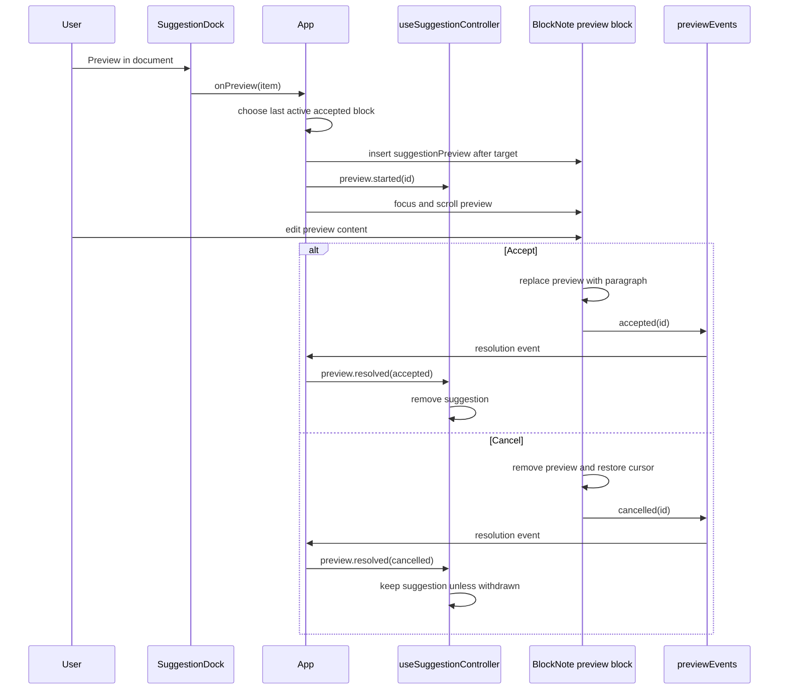
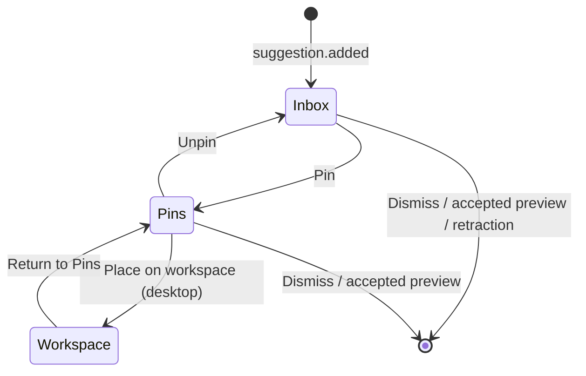

# Editor and suggestion system

This is the core interaction model: Electron emits committed projection events, the suggestion controller reconciles them with optimistic writer commands, and text suggestions can temporarily enter the document as editable previews.

## Domain model

Suggestion value schemas and kind guards are in [`src/domain/suggestions/schema.ts`](../src/domain/suggestions/schema.ts). Cross-process operation contracts are in [`src/contracts/`](../src/contracts/).

### Suggestion kinds

| Kind | Type | Extra data | Can preview into document? | Visual treatment |
| --- | --- | --- | --- | --- |
| `snippet` | `TextSuggestion` | `insertText` | Yes | Text detail |
| `fact` | `TextSuggestion` | `insertText` | Yes | Text detail |
| `term` | `TextSuggestion` | `insertText` | Yes | Text detail |
| `outline` | `StructureSuggestion` | recursive `nodes` | No | Nested structure cards |
| `layout` | `StructureSuggestion` | recursive `nodes` | No | Nested structure cards |
| `mindMap` | `MindMapSuggestion` | Mermaid source and accessible description | No | Lazy-rendered Mermaid diagram |

Every suggestion also carries:

- `id`: identity for updates, retractions, selection, and actions;
- `dedupeKey`: session-level duplicate prevention for additions;
- `title`, `summary`, and `body`: progressively more detailed presentation text;
- `sourceLabels`: display-only attribution labels;
- `createdAt`: ordering and queue-eviction input.

An update uses `id` to replace an existing live item. An addition uses `dedupeKey` to decide whether the session has already seen equivalent content. These fields are related but not interchangeable.

## Desktop event contract

Committed `suggestion.event` payloads carry the event metadata, command ID, projection revision, and complete authoritative projection. Event metadata supports:

| Event | Meaning |
| --- | --- |
| `suggestion.added` | Introduce a suggestion if its `dedupeKey` has not been seen. |
| `suggestion.updated` | Replace a live suggestion with the same `id`. |
| `suggestion.retracted` | Remove a live suggestion from the durable projection. |

The renderer uses one desktop subscription in `useWorkspaceController` and forwards committed suggestion events to [`useSuggestionController`](../src/renderer/features/suggestions/useSuggestionController.ts). The controller compares revisions and command IDs so either the durable event or the command response can acknowledge a writer action first. Suggestions are written before an event is forwarded, so reload hydrates the same projection.

## Inbox state machine

[`useSuggestionController`](../src/renderer/features/suggestions/useSuggestionController.ts) owns:

```text
entries             live inbox suggestions
pinnedEntries       frozen references in the Pins section
workspacePins       frozen references placed over the editor
seenKeys            dedupe keys accepted during this page session
selected detail     renderer-only item shown in detail view
active preview      renderer-only preview snapshot and stale/withdrawn status
nextZIndex          monotonic stacking counter for workspace cards
active/pending commands serialized optimistic writer operations
```

Persisted entry/pin types, empty-state defaults, the 30-entry limit, and eviction order live in [`state.ts`](../src/domain/suggestions/state.ts) and are shared with desktop storage.

### Event behavior

| Situation | Reducer behavior |
| --- | --- |
| Add with a new `dedupeKey` | Append an unread live entry, then enforce the 30-entry limit. |
| Add with a seen `dedupeKey` | Ignore it, even if the earlier entry was dismissed or evicted. |
| Update a normal live item | Replace the item. |
| Update the active preview's live item | Replace the inbox item and mark it stale; the editor preview is untouched. |
| Update a pinned or workspace item | No change to that frozen copy. |
| Retract a normal live item | Remove it. |
| Retract a selected or previewed live item | Remove it durably, but keep a transient snapshot marked withdrawn and stale. |
| Retract a pinned or workspace item | Ignore the retraction. |
| Agent status | Set status and clear error. |
| Agent error | Store the error and return status to idle. |

### Queue limit

The live queue is limited to 30. Pins and workspace cards do not count. If eviction is necessary:

1. viewed items are evicted before unread items;
2. within that group, the oldest `createdAt` value is evicted first;
3. a selected or previewed item evicted from the projection remains available through its transient renderer snapshot.

The UI sorts the remaining live entries differently for display: unread first, then newest first. Pinned entries display most recently pinned first.

### User-action behavior

- Selecting marks the item viewed and opens detail.
- Back clears detail and removes withdrawn entries unless one still owns the active preview.
- Dismiss removes an inbox or pinned item and closes its detail view. Dismiss is disabled while that item has the active preview.
- Pin removes a live item and stores a deep copy with `pinnedAt`. This freezes the content.
- Unpin moves the frozen item back to the live queue and reapplies the queue limit.
- Place on workspace moves a pinned item to the canvas, unless it owns the active preview.
- Return to Pins removes the workspace card and creates a viewed pinned entry.
- Raising a card assigns a new monotonic z-index only if it is not already highest.

Pinned suggestions are cloned through `structuredClone`. Suggestion data is also process-validated JSON and must remain serializable.

## Editable preview lifecycle

Only `snippet`, `fact`, and `term` suggestions expose “Preview in document.” The orchestration is split between `App`, the custom BlockNote block, and the suggestion controller.



### Preview insertion

`App.handlePreview` rejects the request when:

- another preview is active;
- the suggestion is not a text suggestion;
- there is no accepted reference block.

It finds the most recently selected text block among accepted blocks. If that block no longer exists, it falls back to the final accepted top-level block. The preview is inserted immediately after that block with:

- `suggestionId`, for resolving inbox state;
- `targetBlockId`, for cursor restoration on cancellation;
- editable inline content initialized from `insertText`.

The inserted block receives focus and is scrolled toward the center of the viewport.

### Preview rendering and resolution

[`schema.tsx`](../src/renderer/features/editor/schema.tsx) registers `suggestionPreview` alongside BlockNote's default blocks. Its React renderer owns the buttons:

- Accept is disabled if recursive content inspection finds no visible text.
- Accept replaces the custom block with a normal paragraph carrying the edited inline content.
- Cancel removes the block and tries to return the cursor to `targetBlockId`, falling back to the final document block.
- Both outcomes emit an in-process resolution event.

The preview's `toExternalHTML` returns an empty span, so preview content is not intended for exported HTML. There is no export implementation yet, but this protects future default serialization from treating a temporary proposal as accepted text.

### Concurrent feed changes

The preview is a snapshot. If the feed updates the source suggestion, the detail view reports that the item was refined, but the user's editable block is never rewritten. If the feed retracts it, the detail view reports withdrawal and the preview remains resolvable. Cancelling a withdrawn preview removes the suggestion; accepting any preview removes it.

## Pins and workspace cards

Pins are a separate lifecycle from previews:



When a card is placed, the reducer marks it `pendingInitialPlacement`. On the next animation frame, [`DocumentEditor`](../src/renderer/features/editor/DocumentEditor.tsx) calculates a visible position based on:

- suggestion-kind default size;
- current canvas width and height;
- current scroll viewport;
- a five-position, 24 px cascade.

It then commits the geometry, clearing the pending flag. [`WorkspacePins`](../src/renderer/features/suggestions/workspace-pins/WorkspacePins.tsx) renders only committed cards and clamps them whenever the canvas changes size.

Initial sizes are:

| Content | Width | Height |
| --- | ---: | ---: |
| Text suggestion | 320 px | 240 px |
| Outline or layout | 380 px | 300 px |
| Mind map | 460 px | 340 px |

Cards cannot be smaller than 280 × 180 px and keep 16 px of edge padding. Geometry and z-order are included in the persisted suggestion projection and restored on reload.

## Mermaid rendering

Mind maps use [`MermaidDiagram`](../src/renderer/features/suggestions/dock/MermaidDiagram.tsx):

- the `mermaid` package is imported once, lazily;
- the singleton is initialized with `securityLevel: "strict"` and `startOnLoad: false`;
- untrusted diagram source is assigned to a dedicated render host as text before Mermaid processes it;
- Mermaid's managed-node API renders its sanitized SVG into a `role="img"` container with a combined title and accessible description;
- errors render the description as a visible fallback;
- the effect ignores late async results after unmount.

Keep Mermaid in strict mode and preserve the text-only application boundary when changing the rendering integration.
