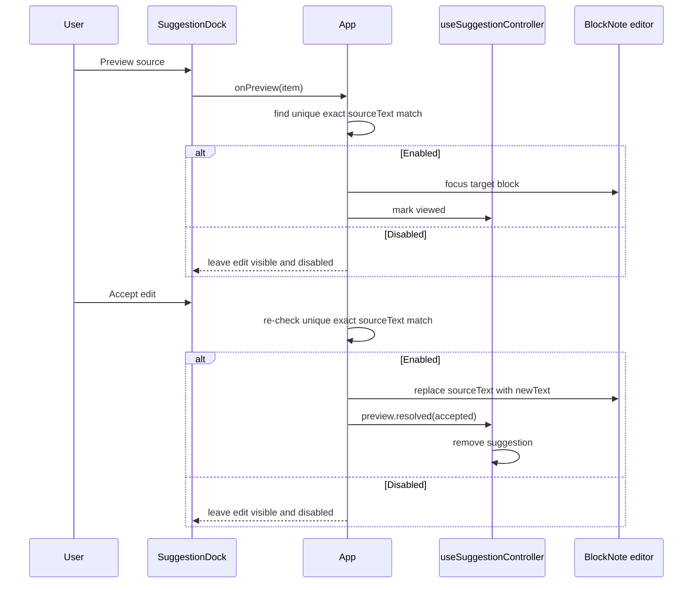
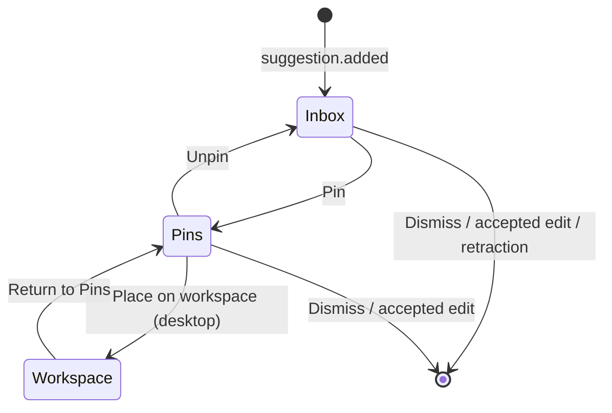

# Editor and suggestion system

This is the core interaction model: Electron emits committed projection events, the suggestion controller reconciles them with optimistic writer commands, and edit suggestions can target exact source text in the current document.

## Domain model

Suggestion value schemas and kind guards are in [`src/domain/suggestions/schema.ts`](../src/domain/suggestions/schema.ts). Cross-process operation contracts are in [`src/contracts/`](../src/contracts/).

### Suggestion kinds

| Kind | Type | Extra data | Preview behavior | Visual treatment |
| --- | --- | --- | --- | --- |
| `edit` | `EditSuggestion` | `sourceText`, `newText` | Focuses the current source text; accept replaces it. | Source/new text diff |
| `note` | `NoteSuggestion` | none beyond common fields | No preview or accept action. | Text detail |
| `diagram` | `DiagramSuggestion` | Mermaid source and accessible description | No preview or accept action. | Lazy-rendered Mermaid diagram |

Every suggestion also carries:

- `id`: identity for updates, retractions, selection, and actions;
- `dedupeKey`: session-level duplicate prevention for additions;
- `title`, `summary`, and `body`: progressively more detailed presentation text;
- `sourceLabels`: display-only attribution labels;
- `createdAt`: ordering and queue-eviction input.

An update uses `id` to replace an existing live item. An addition uses `dedupeKey` to decide whether the session has already seen equivalent content. These fields are related but not interchangeable.

## Desktop event contract

Committed `suggestion.event` payloads carry the event metadata, command ID, projection revision, and complete authoritative projection. Event metadata supports:

| Event | Meaning |
| --- | --- |
| `suggestion.added` | Introduce a suggestion if its `dedupeKey` has not been seen. |
| `suggestion.updated` | Replace a live suggestion with the same `id`. |
| `suggestion.retracted` | Remove a live suggestion from the durable projection. |

The renderer uses one desktop subscription in `useWorkspaceController` and forwards committed suggestion events to [`useSuggestionController`](../src/renderer/features/suggestions/useSuggestionController.ts). The controller compares revisions and command IDs so either the durable event or the command response can acknowledge a writer action first. Suggestions are written before an event is forwarded, so reload hydrates the same projection.

## Inbox state machine

[`useSuggestionController`](../src/renderer/features/suggestions/useSuggestionController.ts) owns:

```text
entries             live inbox suggestions
pinnedEntries       frozen references in the Pins section
workspacePins       frozen references placed over the editor
seenKeys            dedupe keys accepted during this page session
selected detail     renderer-only item shown in detail view
nextZIndex          monotonic stacking counter for workspace cards
active/pending commands serialized optimistic writer operations
```

Persisted entry/pin types, empty-state defaults, the 30-entry limit, and eviction order live in [`state.ts`](../src/domain/suggestions/state.ts) and are shared with desktop storage.

### Event behavior

| Situation | Reducer behavior |
| --- | --- |
| Add with a new `dedupeKey` | Append an unread live entry, then enforce the 30-entry limit. |
| Add with a seen `dedupeKey` | Ignore it, even if the earlier entry was dismissed or evicted. |
| Update a normal live item | Replace the item. |
| Update a pinned or workspace item | No change to that frozen copy. |
| Retract a normal live item | Remove it. |
| Retract a selected live item | Remove it durably, but keep a transient snapshot marked withdrawn and stale. |
| Retract a pinned or workspace item | Ignore the retraction. |
| Agent status | Set status and clear error. |
| Agent error | Store the error and return status to idle. |

### Queue limit

The live queue is limited to 30. Pins and workspace cards do not count. If eviction is necessary:

1. viewed items are evicted before unread items;
2. within that group, the oldest `createdAt` value is evicted first;
3. a selected item evicted from the projection remains available through its transient renderer snapshot.

The UI sorts the remaining live entries differently for display: unread first, then newest first. Pinned entries display most recently pinned first.

### User-action behavior

- Selecting marks the item viewed and opens detail.
- Back clears detail.
- Dismiss removes an inbox or pinned item and closes its detail view.
- Pin removes a live item and stores a deep copy with `pinnedAt`. This freezes the content.
- Unpin moves the frozen item back to the live queue and reapplies the queue limit.
- Place on workspace moves a pinned item to the canvas.
- Return to Pins removes the workspace card and creates a viewed pinned entry.
- Raising a card assigns a new monotonic z-index only if it is not already highest.

Pinned suggestions are cloned through `structuredClone`. Suggestion data is also process-validated JSON and must remain serializable.

## Edit lifecycle

Only `edit` suggestions expose preview and accept actions. The edit is attached to exact `sourceText`, not to a stored block id or position. The renderer recalculates the current target from accepted document blocks whenever suggestion presentation is derived.



### Anchoring and disabled state

An edit is enabled only when `sourceText` appears exactly once in accepted document block text. It is disabled when:

- `sourceText` no longer appears;
- `sourceText` appears more than once;
- the target cannot be represented by the current editor adapter.

Disabled edits stay visible, are greyed out, and remain dismissible. They cannot be previewed or accepted. Because the target is recalculated from current text, inserting content above the target does not disable the edit.

### Accept behavior

Accepting an edit re-checks the target immediately before mutation. If it is still enabled, the editor replaces the current exact `sourceText` with `newText`, marks the document dirty for autosave, and removes the suggestion through the existing accepted-preview command path. `newText` may be empty, which expresses deletion.

## Pins and workspace cards

Pins are a separate lifecycle from edit acceptance:



When a card is placed, the reducer marks it `pendingInitialPlacement`. On the next animation frame, [`DocumentEditor`](../src/renderer/features/editor/DocumentEditor.tsx) calculates a visible position based on:

- suggestion-kind default size;
- current canvas width and height;
- current scroll viewport;
- a five-position, 24 px cascade.

It then commits the geometry, clearing the pending flag. [`WorkspacePins`](../src/renderer/features/suggestions/workspace-pins/WorkspacePins.tsx) renders only committed cards and clamps them whenever the canvas changes size.

Initial sizes are:

| Content | Width | Height |
| --- | ---: | ---: |
| Edit | 320 px | 240 px |
| Note | 340 px | 240 px |
| Diagram | 460 px | 340 px |

Cards cannot be smaller than 280 x 180 px and keep 16 px of edge padding. Geometry and z-order are included in the persisted suggestion projection and restored on reload.

## Mermaid rendering

Diagrams use [`MermaidDiagram`](../src/renderer/features/suggestions/dock/MermaidDiagram.tsx):

- the `mermaid` package is imported once, lazily;
- the singleton is initialized with `securityLevel: "strict"` and `startOnLoad: false`;
- untrusted diagram source is assigned to a dedicated render host as text before Mermaid processes it;
- Mermaid's managed-node API renders its sanitized SVG into a `role="img"` container with a combined title and accessible description;
- errors render the description as a visible fallback;
- the effect ignores late async results after unmount.

Keep Mermaid in strict mode and preserve the text-only application boundary when changing the rendering integration.
